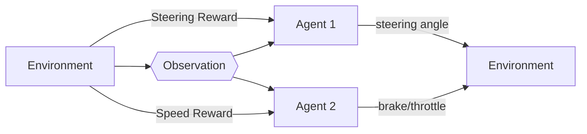

# Multi-Agent Deep Recurrent Q-Network

## **Description**
A simple algorithm of Multi-Agent Deep Recurrent Q-Learning used to control speed and steer simultaneously using AirSim simulator. The structure of the process is illustrated on the following flowchart.

The two agents take respectively actions without any connection, independently. 

In future work, it would be interesting to evaluate a dependent structure between two agents to overcome the independent relation, which is less indicated in this task.

## **Prerequisites**
  * Python 3.7.6 
  * Tensorflow 2.5.0
  * Tornado 4.5.3
  * OpenCV 4.5.2.54
  * OpenAI Gym 0.18.3
  * Airsim 1.5.0

#### **Related Work**
* [Deep Recurrent Q-Network](https://github.com/ValentinaZangirolami/DRL)
